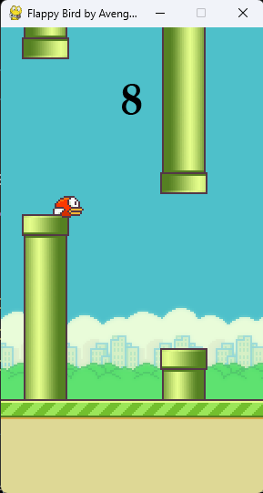

# 🐦 Flappy Bird Game
A faithful recreation of the iconic Flappy Bird game built entirely in Python using Pygame. Navigate your bird through endless pipes and challenge yourself to beat your high score!

<p align="center">  </p>

## 📖 About
This project is a complete implementation of the classic Flappy Bird arcade game. Control a small bird as it flies through a series of green pipes, earning points for each successful passage. The game features smooth animations, responsive controls, and authentic gameplay mechanics that capture the addictive nature of the original.

## ✨ Features
- **Classic Gameplay**: Authentic Flappy Bird experience with smooth physics
- **Simple Controls**: One-key control system for easy pick-up-and-play action
- **Score Tracking**: Real-time score display tracking successful pipe passages
- **Dynamic Obstacles**: Randomly generated pipe heights for unique challenges
- **Collision Detection**: Precise hit detection for fair and challenging gameplay
- **Game Over System**: Clear feedback when colliding with pipes or ground
- **Smooth Animations**: Fluid bird movement and scrolling background
- **Retro Graphics**: Classic pixel-art style visuals

## 🎮 How to Play
1. Press **SPACE** or **UP ARROW** to make the bird flap and fly upward
2. Navigate through the gaps between green pipes
3. Avoid hitting pipes or falling to the ground
4. Earn 1 point for each set of pipes you successfully pass through
5. Try to achieve the highest score possible!

**Tip**: Timing is everything! Master the rhythm of tapping to maintain steady flight.

## 🛠️ Installation
### Prerequisites
- Python 3.x installed on your system
- pip package manager

### Setup Instructions
1. **Clone the repository**
   ```bash
   git clone https://github.com/Vaibhav0460/Flappy-Bird-Game.git
   cd Flappy-Bird-Game
   ```

2. **Install Pygame**
   ```bash
   pip install pygame
   ```

3. **Run the game**
   ```bash
   python flappybird.py
   ```

## 🎯 Game Mechanics
- **Gravity**: The bird continuously falls due to gravity simulation
- **Flap Physics**: Each jump gives an upward impulse to counter gravity
- **Pipe Movement**: Pipes scroll from right to left at constant speed
- **Gap Positioning**: Pipes have variable heights with consistent gap sizes
- **Collision System**: Game detects collisions with pipes, ground, and ceiling

## 🔧 Technical Details
The game is built using:
- **Python 3**: Core programming language
- **Pygame**: Game development library for graphics and input handling
- **Object-Oriented Programming**: Clean code structure with classes for game entities
- **Event-Driven Architecture**: Responsive input handling and game loop management

### Key Components
- **Bird Class**: Handles bird physics, animation, and collision boundaries
- **Pipe Class**: Manages pipe generation, movement, and positioning
- **Game Loop**: Controls frame rate, updates game state, and renders graphics
- **Score System**: Tracks and displays player performance

## 🎨 Customization
Feel free to customize the game by:
- Modifying pipe gap sizes for difficulty adjustment
- Changing gravity and jump strength values
- Replacing sprite images with custom artwork
- Adding sound effects and background music
- Implementing difficulty progression

## 🙏 Acknowledgments
- Inspired by the original Flappy Bird game created by Dong Nguyen
- Built with Python and Pygame libraries
- Thanks to the open-source community for game development resources

## 📧 Contact

**Vaibhav Mishra**  
Portfolio: [vaibhav0460.github.io](https://vaibhav0460.github.io)  
Email: vaibhav0460@gmail.com

---

**Enjoy the game and happy coding! 🚀**
